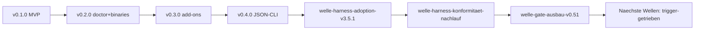

# u-boot Roadmap

**Status:** Aktiv. **Letzte Änderung:** 2026-07-25.

**Format-Regel:** Die Roadmap ist eine Reihenfolge von **Wellen**, keine
Reihenfolge von Terminen (Kurs Modul 6, vendored unter
`.harness/baseline/v3.5.2/regelwerk/modul-06-roadmap.md`). u-boots Wellen
entsprechen den **Release-Versionen**; Termine erscheinen nur als *Konsequenz*
einer abgeschlossenen Welle (Release-Datum), nicht als Treiber. Diese Datei
liegt dauerhaft in `in-progress/` und bleibt bewusst knapp: der per-Slice-
Audit-Trail lebt in den `done/`-Slices, die Release-Historie in
[`docs/archive/roadmap-history-v0.1-v0.3.md`](../../../archive/roadmap-history-v0.1-v0.3.md).

## Aktuelle Welle

**Welle-ID:** `welle-gate-ausbau-v0.51`
**Stand:** 2026-07-25

Der Bump des `d-check`-Gate-Images von `0.2.0` auf `v0.51.1` hat 16 neue
Regelmodule und das `ids`-Schema-Feld `link-policy` freigeschaltet. Diese Welle
schaltet die für u-boot einschlägigen Prüfungen scharf — Disziplinen, die
heute an Aufmerksamkeit hängen, bekommen einen Sensor. Kein Produkt-Delta.

| Slice | Inhalt | Status |
|---|---|---|
| [`slice-gate-print-mk-einbindung`](../open/slice-gate-print-mk-einbindung.md) | `--print-mk`-Fragment einbinden, `docs-check` als Alias auf `doc-check` | open |
| [`slice-gate-planning-targets-module`](../open/slice-gate-planning-targets-module.md) | `planning` (Roadmap ↔ Lifecycle) + `targets` (Gate-Tabelle ↔ Makefile) | open |
| [`slice-gate-ids-link-policy-always`](../open/slice-gate-ids-link-policy-always.md) | `ids` prüft auch Code-Spans; 100 Befunde gemessen, `exempt-paths`-Politik zu entscheiden | open |
| [`slice-gate-immutabilitaets-sensor`](../open/slice-gate-immutabilitaets-sensor.md) | `vcs`-Sensor für die zwei Immutabilitäts-Hard-Rules (Accepted-ADRs, `done/`) | open |

Reihenfolge ist Ökonomie, keine Abhängigkeit: Das Fragment bringt fertige
Targets für die übrigen Module mit, deshalb zuerst.

Die Vorwelle `welle-harness-konformitaet-nachlauf` ist **abgeschlossen** (s.
Abgeschlossene Wellen).

**Baseline-Stand:** Der Review-Bump auf **`v3.5.2`** (Kurs-Welle 34) ist am
2026-07-25 als Einzel-Slice ohne Welle ausgeführt
([`slice-harness-baseline-bump-review-v3.5.2`](../done/slice-harness-baseline-bump-review-v3.5.2.md)),
weil sein Trigger als einziger bereits gefeuert war. Das Freshness-Audit meldet
seither Exit 0.

**Vertrags-Stand:** Ein Befund dieses Bumps ist ebenfalls geschlossen
([`slice-harness-lastenheft-historie-cr-fussabdruck`](../done/slice-harness-lastenheft-historie-cr-fussabdruck.md)):
[`spec/lastenheft.md`](../../../../spec/lastenheft.md) steht seit 2026-07-25 auf
Version `0.2.0`, Status `Accepted`, und trägt einen Historie-Abschnitt als
Fußabdruck angenommener Vertragsänderungen.

**Architektur-Stand:** [`spec/architecture.md`](../../../../spec/architecture.md)
§2 ist gegen den Ist-Bestand abgeglichen
([`slice-harness-architecture-bestandsabgleich`](../done/slice-harness-architecture-bestandsabgleich.md));
die Sicht beschrieb zuvor weitgehend den Stand nach den ersten beiden
Meilensteinen.

**Doku-Stand:** Die Code-Paket-READMEs unter `internal/` liegen seit
2026-07-25 im Referenz-Scan
([`slice-harness-internal-readme-kennungs-retrofit`](../done/slice-harness-internal-readme-kennungs-retrofit.md));
`make docs-check` deckt damit 139 statt 132 Dateien, und die letzte
Brownfield-Sub-Area ist auf Greenfield graduiert.

**Nach dieser Welle:** kein triggerloser Aufsatzpunkt mehr — die verbleibenden
Einträge unter Nächste Wellen warten sämtlich auf externe Trigger
(Nutzeranfragen, Real-World-Befunde, ADR-Annahmen). Produkt-Wellen (v0.5.0)
ebenso.

## Nächste Wellen

| Welle | Trigger | Wichtigste Slices | Aufwand |
|---|---|---|---|
| macOS-Distribution | konkrete Homebrew-Nutzeranfrage | [`slice-v2-homebrew-formula`](../open/slice-v2-homebrew-formula.md) | S |
| Linux-Pakete | konkrete Debian-/RPM-Anfrage | [`slice-v2-distro-pakete`](../open/slice-v2-distro-pakete.md) ([ADR-0007](../../adr/0007-distributionswege-ghcr.md)) | M |
| Devcontainer-Robustheit | Real-World-Half-State-Beschwerde oder Schema-Erweiterung | [`slice-v2-generate-devcontainer-rollback-aware-write`](../open/slice-v2-generate-devcontainer-rollback-aware-write.md) | M |
| CI-Stabilität | belastbare Keycloak-Flake-Logs (Quay-/Mirror-Befund) | [`slice-v1-keycloak-ci-flake`](../open/slice-v1-keycloak-ci-flake.md) | S |
| Harness-Scaffolding (Produkt) | [ADR-0011](../../adr/0011-agent-harness-scaffolding.md) accepted + Spec-Erweiterung + Lizenz-Check | `slice-vN-harness-bootstrap-scaffold` (noch kein Plan) | L |
| Devcontainer-Egress-Firewall | [ADR-0012](../../adr/0012-devcontainer-egress-firewall.md) accepted + Spec-Erweiterung | `slice-vN-devcontainer-egress-firewall` (noch kein Plan) | M |
| Podman-first / Migration / Custom-Sources | Konkretisierung je Thema offen | `slice-vN-podman-formal`; `slice-later-migration` ([`LH-FA-CONF-006`](../../../../spec/lastenheft.md#lh-fa-conf-006--konfiguration-migrieren)); `slice-later-custom-data-sources` ([`LH-DA-004`](../../../../spec/lastenheft.md#lh-da-004--schema-migration)) | L |

## Meilensteine

<!-- Externe Versprechen / interne Trigger-Punkte; Datum als Konsequenz, nicht Treiber. -->

| Meilenstein | Welle(n) | Trigger / Fokus | Status |
|---|---|---|---|
| MVP-CLI + Release-Pipeline | v0.1.0 | Core-Subcommands, GHCR, CI/Gates | erreicht (2026-05-31) |
| Container-aware `doctor` + Binaries | v0.2.0 | Plattform-Binaries, Template-Katalog | erreicht (2026-06-01) |
| Add-on Catalogue Expansion | v0.3.0 | `remove`, `--with-deps`, Keycloak, OTel | erreicht (2026-06-01) |
| Maschinenlesbare CLI | v0.4.0 | `--json`/`--dry-run`/`--diff` alle 10 Subcommands, `logs`, Devcontainer-Features | erreicht (2026-06-08) |
| Nächstes Produkt-Release | v0.5.0 | trigger-getrieben (siehe Nächste Wellen) | offen |

## Abhängigkeitsgraph

## Abgeschlossene Wellen

| Welle | Abschluss | Closure-Notiz (Detailquelle) |
|---|---|---|
| v0.1.0 (MVP M1..M8) | 2026-05-31 | [`slice-v1-release-cut-v0.1.0`](../done/slice-v1-release-cut-v0.1.0.md); [`docs/archive/roadmap-history-v0.1-v0.3.md`](../../../archive/roadmap-history-v0.1-v0.3.md) |
| v0.2.0 | 2026-06-01 | [`slice-v1-release-cut-v0.2.0`](../done/slice-v1-release-cut-v0.2.0.md) |
| v0.3.0 | 2026-06-01 | [`slice-v1-release-cut-v0.3.0`](../done/slice-v1-release-cut-v0.3.0.md) |
| v0.4.0 (maschinenlesbare CLI, `logs`, Devcontainer-Features) | 2026-06-08 | [`slice-v1-release-cut-v0.4.0`](../done/slice-v1-release-cut-v0.4.0.md); JSON-CLI-Cluster [`slice-v1-cli-json-dry-run`](../done/slice-v1-cli-json-dry-run.md) (9/9 Folge-Slices + `T_close`, `3a35d58`) |
| Lokale FS-Templates | 2026-06 | [`slice-later-local-templates`](../done/slice-later-local-templates.md) ([`LH-FA-TPL-003`](../../../../spec/lastenheft.md#lh-fa-tpl-003--eigene-templates)) |
| welle-harness-adoption-v3.5.1 (Regelwerk v3.5.1 + ADR-Format-CR auf MADR) | 2026-07-24 | [`slice-harness-regelwerk-adoption-v3.5.1`](../done/slice-harness-regelwerk-adoption-v3.5.1.md) (`8d897d3`); [`slice-cr-adr-format-madr`](../done/slice-cr-adr-format-madr.md) (`7633cbb`) |
| welle-harness-konformitaet-nachlauf (FS-1..FS-4 + `architecture.md`-Template-Konformität) | 2026-07-25 | [`slice-harness-reviewer-skills-und-review-ablage`](../done/slice-harness-reviewer-skills-und-review-ablage.md) (`d5d896a`); [`slice-harness-sub-area-modus-audit`](../done/slice-harness-sub-area-modus-audit.md) (`be3d33c`); [`slice-harness-baseline-freshness-audit`](../done/slice-harness-baseline-freshness-audit.md) (`c7fe437`); [`slice-harness-architecture-template-konformitaet`](../done/slice-harness-architecture-template-konformitaet.md) (`c35249d`); Review-Findings (`4fed84f`), Report in [`docs/reviews/`](../../../reviews/README.md) |

> **Closure-Form (Abweichung, MR-003).** u-boot führt **keine**
> `welle-NN-results.md`; die Welle-Closure lebt vollständig im jeweiligen
> `done/`-Release-Cut-Slice (Detailquelle inkl. Tranchen-Hashes).

## Historische Trigger-Verschiebungen

<!-- Umplanungen: Datum, Änderung, Grund. Steering-Loop-relevant. -->

| Datum | Was wurde geändert? | Warum? |
|---|---|---|
| 2026-06-08 | JSON-CLI als 9-teiliger Cluster vor v0.4.0 gezogen | [ADR-0010](../../adr/0010-kein-http-driving-adapter.md) Re-Eval-Trigger 2; V1-pünktlich statt HTTP-Adapter |
| laufend | Debian/RPM + Homebrew auf konkrete Anfrage vertagt | Packaging-Overhead ohne belastbare Nachfrage ([ADR-0007](../../adr/0007-distributionswege-ghcr.md)) |

## Verwandte Dokumente

- [`carveouts.md`](carveouts.md) — Master-Inventar aller temporären und
  permanenten Carveouts ([`LH-FA-PROJDOCS-005`](../../../../spec/lastenheft.md#lh-fa-projdocs-005--carveout-disziplin)),
  plus Audit-Trail der Slices, die offene Carveouts geschlossen haben.
- [`README.md`](../README.md) — Slice-/Tranche-Konventionen für Dateinamen in
  `docs/plan/planning/` ([`LH-FA-PROJDOCS-003`](../../../../spec/lastenheft.md#lh-fa-projdocs-003--planning-lifecycle)).
- [`docs/archive/roadmap-history-v0.1-v0.3.md`](../../../archive/roadmap-history-v0.1-v0.3.md)
  — ausgelagerte Release-Historie.

## Pflege-Regeln

- Diese Roadmap beschreibt Wellen-Steuerung (Reihenfolge, Trigger,
  Abhängigkeiten), nicht jede historische Tranche.
- Release-Details, lange Commit-Listen und retrospektive Tabellen gehören in
  `done/`-Slices oder nach `docs/archive/`.
- Neue Wellen brauchen einen beobachtbaren Trigger und die wichtigsten Slices.
  Ohne ausgearbeiteten Plan bleibt eine Welle als benannter Eintrag hier, nicht
  als halbfertiger Slice.
- Diese Datei ist die einzige zulässige Ausnahme von der
  `slice-`/`tranche-`-Namenskonvention in `docs/plan/planning/` (siehe
  [`LH-FA-PROJDOCS-003`](../../../../spec/lastenheft.md#lh-fa-projdocs-003--planning-lifecycle)
  und [`../README.md`](../README.md)).
