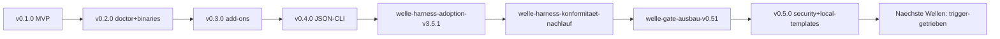

# u-boot Roadmap

**Status:** Aktiv. **Letzte Änderung:** 2026-10-24.

**Format-Regel:** Die Roadmap ist eine Reihenfolge von **Wellen**, keine
Reihenfolge von Terminen (Kurs Modul 6, vendored unter
`.harness/baseline/v6.18.1/regelwerk/modul-06-roadmap.md`). u-boots Wellen
entsprechen den **Release-Versionen**; Termine erscheinen nur als *Konsequenz*
einer abgeschlossenen Welle (Release-Datum), nicht als Treiber. Diese Datei
liegt dauerhaft in `in-progress/` und bleibt bewusst knapp: der per-Slice-
Audit-Trail lebt in den `done/`-Slices, die Release-Historie in
[`docs/archive/roadmap-history-v0.1-v0.3.md`](../../../archive/roadmap-history-v0.1-v0.3.md).

## Offene Wellen

Derivativ: Der Zustand sind die flachen Welle-Dateien unter `docs/plan/planning/`; woran gearbeitet
wird, sagt das `Welle:`-Feld der Slices in `in-progress/`. Ziel, Trigger und Closure-Kriterien
stehen in der Welle-Datei, nicht hier.

Offen: [`welle-ollama-cloud-modelle`](../welle-ollama-cloud-modelle.md) (Cloud-Modelle von Ollama mit Claude Code im Devcontainer, `ollama launch claude`; fünf Slices mit Datei (beide Messungen, die Folge-ADR [`ADR-0036`](../../adr/0036-cloud-modelle-von-ollama-im-devcontainer.md), Ausgang A, der Lastenheft-CR [`slice-cr-lastenheft-ollama-cloud-modelle`](../done/slice-cr-lastenheft-ollama-cloud-modelle.md), Lastenheft `0.23.2`, und der Code-Slice [`slice-v1-devcontainer-ollama-cloud`](../done/slice-v1-devcontainer-ollama-cloud.md), alle fünf in `done/`), zwei weitere benannt ohne Datei (Spezifikation `slice-v2-spec-ollama-cloud`, Release-Cut zuletzt, davor der Validator-Bericht); Release `v0.16.0`).

Nichts in Arbeit.

## Nächste Wellen

| Welle | Trigger | Wichtigste Slices | Aufwand |
|---|---|---|---|
| Harness-Scaffolding (Produkt) | [ADR-0011](../../adr/0011-agent-harness-scaffolding.md) accepted + Spec-Erweiterung + Lizenz-Check | `slice-vN-harness-bootstrap-scaffold` (noch kein Plan) | L |
| Podman-first / Migration / Custom-Sources | Konkretisierung je Thema offen | `slice-vN-podman-formal`; `slice-later-migration` ([`LH-FA-CONF-006`](../../../../spec/lastenheft.md#lh-fa-conf-006--konfiguration-migrieren)); `slice-later-custom-data-sources` ([`LH-DA-004`](../../../../spec/lastenheft.md#lh-da-004--schema-migration)) | L |

## Meilensteine

<!-- Externe Versprechen / interne Trigger-Punkte; Datum als Konsequenz, nicht Treiber. -->

| Meilenstein | Welle(n) | Trigger / Fokus | Status |
|---|---|---|---|
| MVP-CLI + Release-Pipeline | v0.1.0 | Core-Subcommands, GHCR, CI/Gates | erreicht (2026-05-31) |
| Container-aware `doctor` + Binaries | v0.2.0 | Plattform-Binaries, Template-Katalog | erreicht (2026-06-01) |
| Add-on Catalogue Expansion | v0.3.0 | `remove`, `--with-deps`, Keycloak, OTel | erreicht (2026-06-01) |
| Maschinenlesbare CLI | v0.4.0 | `--json`/`--dry-run`/`--diff` alle 10 Subcommands, `logs`, Devcontainer-Features | erreicht (2026-06-08) |
| Nächstes Produkt-Release | v0.5.0 | trigger-getrieben (siehe Nächste Wellen) | erreicht (2026-07-25) |

## Abhängigkeitsgraph

```mermaid
flowchart LR
    V1[v0.1.0 MVP]
    V2[v0.2.0 doctor+binaries]
    V3[v0.3.0 add-ons]
    V4[v0.4.0 JSON-CLI]
    H[welle-harness-adoption-v3.5.1]
    K[welle-harness-konformitaet-nachlauf]
    G[welle-gate-ausbau-v0.51]
    V5[v0.5.0 security+local-templates]
    N[Naechste Wellen: trigger-getrieben]

    V1 --> V2 --> V3 --> V4 --> H --> K --> G --> V5 --> N
```

## Abgeschlossene Wellen

| Welle | Abschluss | Closure-Notiz (Detailquelle) |
|---|---|---|
| v0.1.0 (MVP M1..M8) | 2026-05-31 | [`slice-v1-release-cut-v0.1.0`](../done/slice-v1-release-cut-v0.1.0.md); [`docs/archive/roadmap-history-v0.1-v0.3.md`](../../../archive/roadmap-history-v0.1-v0.3.md) |
| v0.2.0 | 2026-06-01 | [`slice-v1-release-cut-v0.2.0`](../done/slice-v1-release-cut-v0.2.0.md) |
| v0.3.0 | 2026-06-01 | [`slice-v1-release-cut-v0.3.0`](../done/slice-v1-release-cut-v0.3.0.md) |
| v0.4.0 (maschinenlesbare CLI, `logs`, Devcontainer-Features) | 2026-06-08 | [`slice-v1-release-cut-v0.4.0`](../done/slice-v1-release-cut-v0.4.0.md); JSON-CLI-Cluster [`slice-v1-cli-json-dry-run`](../done/slice-v1-cli-json-dry-run.md) (9/9 Folge-Slices + `T_close`, `3a35d58`) |
| Lokale FS-Templates | 2026-06 | [`slice-later-local-templates`](../done/slice-later-local-templates.md) ([`LH-FA-TPL-003`](../../../../spec/lastenheft.md#lh-fa-tpl-003--eigene-templates)) |
| welle-harness-adoption-v3.5.1 (Regelwerk v3.5.1 + ADR-Format-CR auf MADR) | 2026-07-24 | [`slice-harness-regelwerk-adoption-v3.5.1`](../done/slice-harness-regelwerk-adoption-v3.5.1.md) (`8d897d3`); [`slice-cr-adr-format-madr`](../done/slice-cr-adr-format-madr.md) (`7633cbb`) |
| welle-harness-konformitaet-nachlauf (FS-1..FS-4 + `architecture.md`-Template-Konformität) | 2026-07-25 | [`slice-harness-reviewer-skills-und-review-ablage`](../done/slice-harness-reviewer-skills-und-review-ablage.md) (`d5d896a`); [`slice-harness-sub-area-modus-audit`](../done/slice-harness-sub-area-modus-audit.md) (`be3d33c`); [`slice-harness-baseline-freshness-audit`](../done/slice-harness-baseline-freshness-audit.md) (`c7fe437`); [`slice-harness-architecture-template-konformitaet`](../done/slice-harness-architecture-template-konformitaet.md) (`c35249d`); Review-Findings (`4fed84f`), Report in [`docs/reviews/`](../../../reviews/README.md) |
| welle-spec-technik-stratum (Technik-Stratum `spezifikation.md`, Lastenheft 0.4.0, Architektur-Angleichung) | 2026-10-02 | [`slice-v2-spec-technik-stratum-grundlage`](../done/slice-v2-spec-technik-stratum-grundlage.md) (`fdf4c92`); [`slice-v2-spec-schnitt-cli-init-devcontainer`](../done/slice-v2-spec-schnitt-cli-init-devcontainer.md) (`8119daa`); [`slice-v2-spec-schnitt-addons-betrieb`](../done/slice-v2-spec-schnitt-addons-betrieb.md) (`5d4716e`); [`slice-v2-spec-schnitt-projektkapitel`](../done/slice-v2-spec-schnitt-projektkapitel.md) (`d4abd2b`); [`slice-v2-spec-schnitt-qualitaet-akzeptanz-abschluss`](../done/slice-v2-spec-schnitt-qualitaet-akzeptanz-abschluss.md) (`3b98b30`); [`slice-v2-spec-architektur-angleichung`](../done/slice-v2-spec-architektur-angleichung.md) (`5661be3`); Review-Report `docs/reviews/2026-10-02-welle-spec-technik-stratum.md`; [`slice-v2-spec-lastenheft-coverage-default`](../done/slice-v2-spec-lastenheft-coverage-default.md) (durch die Kürzung erledigt); [`slice-v2-spec-lastenheft-verschlankung-runde-3`](../done/slice-v2-spec-lastenheft-verschlankung-runde-3.md) (`05212da`) |
| welle-lastenheft-verschlankung (Verhaltensdetails, Beispiele und Regelwerk-Dopplungen aus dem Lastenheft, 2984 → 1626 Zeilen) | 2026-10-02 | [`slice-v2-spec-lastenheft-verschlankung`](../done/slice-v2-spec-lastenheft-verschlankung.md) (`4cd66a5`); [`slice-v2-spec-lastenheft-verschlankung-runde-2`](../done/slice-v2-spec-lastenheft-verschlankung-runde-2.md) (`d024a1b`) |
| welle-gate-ausbau-v0.51 (d-check-Bump + vier Sensoren) | 2026-07-25 | [`slice-gate-print-mk-einbindung`](../done/slice-gate-print-mk-einbindung.md) (`e246bbf`); [`slice-gate-planning-targets-module`](../done/slice-gate-planning-targets-module.md) (`83efe46`); [`slice-gate-ids-link-policy-always`](../done/slice-gate-ids-link-policy-always.md) (`0d896fc`); [`slice-gate-immutabilitaets-sensor`](../done/slice-gate-immutabilitaets-sensor.md) (`7d9c4c2`); Vorlauf: Image-Bump (`225627c`) |
| v0.5.0 (Security-Release + lokale Templates) | 2026-07-25 | [`slice-v1-release-cut-v0.5.0`](../done/slice-v1-release-cut-v0.5.0.md) — Tag `v0.5.0` auf `1bc071f` |
| Spec-Wartung: Traceability-Matrix konfiguriert | 2026-09-29 | [`slice-gate-rtm-traceability`](../done/slice-gate-rtm-traceability.md) — RTM 79 Anforderungen, 0 Waisen |
| Spec-Wartung: Sandbox-Profil (Lastenheft 0.3.0) | 2026-09-30 | [`slice-cr-sandbox-devcontainer`](../done/slice-cr-sandbox-devcontainer.md) (`712af41`) |
| Sandbox-Profil Umsetzung V1 (Lastenheft 0.3.2) | 2026-09-30 | [`slice-v1-sandbox-devcontainer-umsetzung`](../done/slice-v1-sandbox-devcontainer-umsetzung.md) (`50dbd84`) |
| Sandbox: Egress-Restriktion (Lastenheft 0.3.3) | 2026-09-30 | [`slice-v2-sandbox-egress`](../done/slice-v2-sandbox-egress.md) (`9b1c414`) |
| Config-Erweiterungen (V1-Cleanup) | 2026-10-01 | [`slice-v1-config-structured-hint`](../done/slice-v1-config-structured-hint.md), [`slice-v1-config-multi-path-get`](../done/slice-v1-config-multi-path-get.md), [`slice-v1-config-multi-path-set`](../done/slice-v1-config-multi-path-set.md), [`slice-v1-config-list-subcommand`](../done/slice-v1-config-list-subcommand.md) (`acc0233`) |
| Logs-Erweiterungen (V1-Cleanup) | 2026-10-01 | [`slice-v1-logs-multi-service-filter`](../done/slice-v1-logs-multi-service-filter.md), [`slice-v1-logs-format-flags`](../done/slice-v1-logs-format-flags.md), [`slice-v1-logs-time-range-filter`](../done/slice-v1-logs-time-range-filter.md) (`4db9f90`) |
| Up/Down-Erweiterungen (V1-Cleanup) | 2026-10-01 | [`slice-v1-recreate-detection`](../done/slice-v1-recreate-detection.md), [`slice-v1-multi-port-services`](../done/slice-v1-multi-port-services.md), [`slice-v1-up-partial-snapshot-on-failure`](../done/slice-v1-up-partial-snapshot-on-failure.md), [`slice-v1-down-volumes-named-list`](../done/slice-v1-down-volumes-named-list.md), [`slice-v1-volume-auto-removal`](../done/slice-v1-volume-auto-removal.md) (`c4c9b09`) |
| Generate-Devcontainer-Rollback (V2-Hardening) | 2026-10-01 | [`slice-v2-generate-devcontainer-rollback-aware-write`](../done/slice-v2-generate-devcontainer-rollback-aware-write.md) (`2f12ec6`) |
| v0.6.0 (Sandbox-Devcontainer + V1-Cleanup + Homebrew) | 2026-10-01 | [`slice-v1-release-cut-v0.6.0`](../done/slice-v1-release-cut-v0.6.0.md) — Tag `v0.6.0` auf `76a8200` |
| Spec-Wartung und Umsetzung: Docker als verschachtelte Runtime (Lastenheft 0.5.0, `nestedRuntime: docker`) | 2026-10-14 | [`slice-cr-sandbox-docker-runtime`](../done/slice-cr-sandbox-docker-runtime.md) (`6d726e0`); [`slice-v1-sandbox-docker-generator`](../done/slice-v1-sandbox-docker-generator.md); [`slice-v1-sandbox-docker-degradation-doctor`](../done/slice-v1-sandbox-docker-degradation-doctor.md); [`slice-v1-sandbox-docker-integrationstest`](../done/slice-v1-sandbox-docker-integrationstest.md) (letzte Code-Änderung `e1c2c3a`); Review-Reports `docs/reviews/2026-10-14-sandbox-docker-runtime.md`, `-r2` |
| v0.8.0 (Docker im Sandbox-Devcontainer, `nestedRuntime: docker`) | 2026-10-14 | [`slice-v1-release-cut-v0.8.0`](../done/slice-v1-release-cut-v0.8.0.md) — Tag `v0.8.0` auf `1f2b41b` |
| Docker aus dem Docker-APT-Repo (`nestedRuntime: docker`, [ADR-0019](../../adr/0019-docker-daemon-aus-docker-apt-repo.md)) | 2026-10-14 | [`slice-v1-sandbox-docker-ce`](../done/slice-v1-sandbox-docker-ce.md) (`90f9122`); Review-Reports `docs/reviews/2026-10-14-sandbox-docker-ce.md`, `-r2` |
| v0.8.1 (aktueller Docker im Sandbox-Devcontainer) | 2026-10-14 | [`slice-v1-release-cut-v0.8.1`](../done/slice-v1-release-cut-v0.8.1.md) — Tag `v0.8.1` auf `5aadaf3` |
| Devcontainer-Features `homebrew` und `sdkman` ([ADR-0020](../../adr/0020-drittanbieter-features-im-katalog.md)) | 2026-10-15 | [`slice-v1-devcontainer-features-homebrew-sdkman`](../done/slice-v1-devcontainer-features-homebrew-sdkman.md) (`ac59b83`); Review-Report `docs/reviews/2026-10-15-devcontainer-features-homebrew-sdkman.md` |
| Devcontainer-Feature `python` | 2026-10-15 | [`slice-v1-devcontainer-feature-python`](../done/slice-v1-devcontainer-feature-python.md); Review-Report `docs/reviews/2026-10-15-devcontainer-feature-python.md` |
| v0.9.0 (Devcontainer-Features Homebrew, SDKMAN, Python) | 2026-10-15 | [`slice-v1-release-cut-v0.9.0`](../done/slice-v1-release-cut-v0.9.0.md) — Tag `v0.9.0` auf `7bfd8d6` |
| welle-macos-verifikation (Homebrew-Formel auf macOS belegt; Docker-Desktop-Zusage aus dem Lastenheft 0.7.0 genommen) | 2026-10-16 | [`slice-v2-homebrew-formula`](../done/slice-v2-homebrew-formula.md) (Detailquelle); Welle-Datei [`welle-macos-verifikation`](../done/welle-macos-verifikation.md) §7 |
| welle-harness-wartung (Reviewer-Skill auf Baseline-Schema; `internal/`-README-Festlegungen in der Spezifikation) | 2026-10-16 | [`slice-harness-internal-readmes-festlegungen-in-spec`](../done/slice-harness-internal-readmes-festlegungen-in-spec.md) (Detailquelle); [`slice-harness-dcheck-bump-reviewer-skill`](../done/slice-harness-dcheck-bump-reviewer-skill.md); Welle-Datei [`welle-harness-wartung`](../done/welle-harness-wartung.md) §7 |
| welle-cli-verbosity (Verbosity-Vertrag: `--quiet` nur Fehler mit vier Ausnahmen, Vorschau bleibt, letzte Option gewinnt; Lastenheft 0.8.0 bis 0.10.0, [`SPEC-043`](../../../../spec/spezifikation.md#spec-043--verbosity-pegelabbildung-rangfolge-und-wirkung-von---quiet)) | 2026-10-16 | [`slice-v1-cli-verbosity-letzte-option-gewinnt`](../done/slice-v1-cli-verbosity-letzte-option-gewinnt.md) (Detailquelle); [`slice-cr-cli-quiet-fehler-und-warnungen`](../done/slice-cr-cli-quiet-fehler-und-warnungen.md); [`slice-cr-cli-quiet-weitere-ausnahmen`](../done/slice-cr-cli-quiet-weitere-ausnahmen.md); [`slice-v1-cli-quiet-nur-fehler`](../done/slice-v1-cli-quiet-nur-fehler.md); [`slice-cr-cli-quiet-vorschau`](../done/slice-cr-cli-quiet-vorschau.md); [`slice-v1-cli-quiet-vorschau`](../done/slice-v1-cli-quiet-vorschau.md); Welle-Datei [`welle-cli-verbosity`](../done/welle-cli-verbosity.md) §7 |
| welle-devcontainer-sshd-claude-code (Devcontainer-Features `sshd` und Claude Code im Katalog, Sicherheitswarnungen unter `--quiet`, `podman build` im Sandbox-Devcontainer; Lastenheft 0.11.0 und 0.12.0, [`SPEC-044`](../../../../spec/spezifikation.md#spec-044--features-sshd-und-claude-code-im-devcontainer-warnungen-und-zugangsdaten)) | 2026-10-17 | [`slice-v1-devcontainer-podman-build`](../done/slice-v1-devcontainer-podman-build.md) (Detailquelle); [`slice-cr-devcontainer-agent-features-sandbox`](../done/slice-cr-devcontainer-agent-features-sandbox.md); [`slice-v1-cli-quiet-sicherheitswarnungen`](../done/slice-v1-cli-quiet-sicherheitswarnungen.md); [`slice-v1-devcontainer-feature-sshd`](../done/slice-v1-devcontainer-feature-sshd.md); [`slice-v1-devcontainer-feature-claude-code`](../done/slice-v1-devcontainer-feature-claude-code.md); [`slice-v2-spec-devcontainer-sshd-claude-code`](../done/slice-v2-spec-devcontainer-sshd-claude-code.md); [`slice-v1-cli-egress-ohne-profil-sichtbar`](../done/slice-v1-cli-egress-ohne-profil-sichtbar.md); Validator-Bericht [`2026-10-17-validation-welle-devcontainer-sshd-claude-code`](../../../reviews/2026-10-17-validation-welle-devcontainer-sshd-claude-code.md); Welle-Datei [`welle-devcontainer-sshd-claude-code`](../done/welle-devcontainer-sshd-claude-code.md) §7 |
| v0.10.0 (Devcontainer-Features `sshd` und Claude Code, `podman build`, Verbosity-Vertrag; trägt [`welle-devcontainer-sshd-claude-code`](../done/welle-devcontainer-sshd-claude-code.md), [`welle-cli-verbosity`](../done/welle-cli-verbosity.md), [`welle-macos-verifikation`](../done/welle-macos-verifikation.md) und [`welle-harness-wartung`](../done/welle-harness-wartung.md)) | 2026-10-17 | [`slice-v1-release-cut-v0.10.0`](../done/slice-v1-release-cut-v0.10.0.md) — Tag `v0.10.0` auf `f50690c` |
| v0.11.0 (Fallback-Ausweisung vom Host, fehlendes `/dev/fuse` als Startfehler, `doctor` im Container, Dry-Run „Would“, Podman 6.1.4, `sshd`-Anleitung, e2e-Helfer; trägt die Slices seit `v0.10.0`) | 2026-10-18 | [`slice-v1-release-cut-v0.11.0`](../done/slice-v1-release-cut-v0.11.0.md) — Tag `v0.11.0` auf `6926ad6` |
| welle-sandbox-egress-ollama (Egress im Sandbox-Profil: Anzeige `u-boot egress list`, Subdomain-Aussage belegt, Wildcard-Syntax entfallen, Neuaufbau statt Neu-Laden; Ollama als Katalog-Feature; Lastenheft 0.14.0 bis 0.16.0, [`SPEC-046`](../../../../spec/spezifikation.md#spec-046--egress-anzeige-u-boot-egress-list-berechnung-ausgabe-und-abgrenzung), [`SPEC-047`](../../../../spec/spezifikation.md#spec-047--feature-ollama-im-sandbox-devcontainer-installation-volume-meldungen-und-grenzen); Release `v0.12.0` (Zuordnung des Projektinhabers); die beiden Release-Gates (Befehlsübersicht `egress list`, Enum `egress`) am 2026-10-19 vom Projektinhaber bestätigt, Wortlaut unverändert; Welle-Datei §7) | 2026-10-19 | [`slice-v2-spec-sandbox-egress-ollama`](../done/slice-v2-spec-sandbox-egress-ollama.md) (Detailquelle); [`slice-v1-egress-wildcard-pruefung`](../done/slice-v1-egress-wildcard-pruefung.md); [`slice-cr-sandbox-egress-anzeige`](../done/slice-cr-sandbox-egress-anzeige.md); [`slice-v1-cli-egress-anzeige`](../done/slice-v1-cli-egress-anzeige.md); [`slice-v1-sandbox-egress-neuladen-entwurf`](../done/slice-v1-sandbox-egress-neuladen-entwurf.md); [`slice-v1-devcontainer-ollama-messung`](../done/slice-v1-devcontainer-ollama-messung.md); [`slice-cr-devcontainer-ollama`](../done/slice-cr-devcontainer-ollama.md); [`slice-cr-cli-json-command-enum`](../done/slice-cr-cli-json-command-enum.md); [`slice-v1-devcontainer-feature-ollama`](../done/slice-v1-devcontainer-feature-ollama.md); Validator-Bericht [`2026-10-19-validation-welle-sandbox-egress-ollama`](../../../reviews/2026-10-19-validation-welle-sandbox-egress-ollama.md); Welle-Datei [`welle-sandbox-egress-ollama`](../done/welle-sandbox-egress-ollama.md) §7 |
| v0.12.0 (Egress-Anzeige `u-boot egress list`, Subdomain-Klärung, Neuaufbau statt Neu-Laden, Katalog-Feature `ollama` ohne Cloud-Modelle; trägt [`welle-sandbox-egress-ollama`](../done/welle-sandbox-egress-ollama.md) und die Slices seit `v0.11.0`) | 2026-10-19 | [`slice-v1-release-cut-v0.12.0`](../done/slice-v1-release-cut-v0.12.0.md) — Tag `v0.12.0` auf `9c28c5c` |
| welle-devcontainer-start-ohne-editor (Devcontainer ohne Editor und ohne Node/CLI auf dem Host starten: `u-boot devcontainer up [--recreate]` und `down`, Dev-Container-CLI im lokal gebauten Hilfs-Image, Docker-Socket nur für den Befehl und ausgewiesen; Zusage Linux-Host `amd64` mit lokaler Engine, Colima nicht zugesagt; Lastenheft 0.18.0, [`LH-FA-DEV-010`](../../../../spec/lastenheft.md#lh-fa-dev-010--devcontainer-ohne-editor-starten), [`SPEC-049`](../../../../spec/spezifikation.md#spec-049--devcontainer-ohne-editor-starten-und-stoppen-u-boot-devcontainer-up-und-down-aufruf-vorab-prüfung-umgebung-ausgabe-und-exit-codes), [`ADR-0028`](../../adr/0028-devcontainer-start-ohne-editor-hilfs-image.md), [`ADR-0029`](../../adr/0029-devcontainer-start-exit-11-und-socket-haltung.md); Release `v0.13.0` (das nächste Minor nach `v0.12.0`, Nummer vom Projektinhaber bestätigt am 2026-10-21); Aufträge an den Release-Cut in der Welle-Datei §7) | 2026-10-21 | [`slice-v2-spec-devcontainer-start`](../done/slice-v2-spec-devcontainer-start.md) (Detailquelle); [`slice-v1-devcontainer-start-ohne-cli`](../done/slice-v1-devcontainer-start-ohne-cli.md); [`slice-cr-devcontainer-start-ohne-editor`](../done/slice-cr-devcontainer-start-ohne-editor.md); [`slice-v1-devcontainer-start-fundament`](../done/slice-v1-devcontainer-start-fundament.md); [`slice-v1-cli-devcontainer-up-down`](../done/slice-v1-cli-devcontainer-up-down.md); Validator-Bericht [`2026-10-21-validation-welle-devcontainer-start-ohne-editor`](../../../reviews/2026-10-21-validation-welle-devcontainer-start-ohne-editor.md); Welle-Datei [`welle-devcontainer-start-ohne-editor`](../done/welle-devcontainer-start-ohne-editor.md) §7 |
| v0.13.0 (`u-boot devcontainer up [--recreate]` und `down` ohne Editor, zugesagt für einen Linux-Host `amd64` mit lokaler Engine; DNS zu den Upstream-Resolvern nur für den lokalen Resolver, Wiederholungslauf des Egress-Startscripts in einer Transaktion, Warnung beim Ersetzen von `egress-init.sh`; trägt [`welle-devcontainer-start-ohne-editor`](../done/welle-devcontainer-start-ohne-editor.md) und die Slices seit `v0.12.0`) | 2026-10-21 | [`slice-v1-release-cut-v0.13.0`](../done/slice-v1-release-cut-v0.13.0.md) — Tag `v0.13.0` auf `df4e5cc3` |
| v0.13.1 (Patch-Release vor `v0.14.0`, ohne Welle-Datei: im Sandbox-Profil ist `docker-cli` ein fachlicher Fehler (Exit-Code `10`, `doctor` meldet `11`), die Lockerungen von `go` und Features aus externen Quellen sind in der Befehlsausgabe ausgewiesen, die Socket-Aussagen von `devcontainer up`, Hilfe und Handbuch sind für beide Profile berichtigt; Eintrag *Security* und Security Advisory `GHSA-9269-r4v3-8vcg`; Go-Toolchain 1.27.3; Lastenheft 0.21.0, [`ADR-0032`](../../adr/0032-katalog-features-socket-und-lockerungen.md); trägt den Bugfix [`slice-v1-sandbox-features-socket-und-lockerungen`](../done/slice-v1-sandbox-features-socket-und-lockerungen.md)) | 2026-10-22 | [`slice-v1-release-cut-v0.13.1`](../done/slice-v1-release-cut-v0.13.1.md) — Tag `v0.13.1` auf `52e368e4` |
| welle-devcontainer-shell-und-zweites-up (Shell im Devcontainer ohne Editor: `u-boot devcontainer shell`, und erneutes `up` nach dem Zustand des Containers: Klasse `11` auch beim erneuten `up`, Erfolgszeile `already running`, Feld `alreadyRunning`; Zusage Linux-Host `amd64` mit lokaler Engine, Colima nicht zugesagt; Lastenheft 0.20.0 (in 0.21.0 enthalten), [`LH-FA-DEV-010`](../../../../spec/lastenheft.md#lh-fa-dev-010--devcontainer-ohne-editor-starten), [`SPEC-049`](../../../../spec/spezifikation.md#spec-049--devcontainer-ohne-editor-starten-und-stoppen-u-boot-devcontainer-up-und-down-aufruf-vorab-prüfung-umgebung-ausgabe-und-exit-codes), [`ADR-0030`](../../adr/0030-devcontainer-up-failed-nach-zustand.md), [`ADR-0031`](../../adr/0031-devcontainer-shell-ohne-editor.md), [`ADR-0033`](../../adr/0033-devcontainer-up-laufender-container-lebenszyklus-befehle.md), [`ADR-0034`](../../adr/0034-devcontainer-shell-ende-des-clients-und-keine-login-shell.md); Release `v0.14.0` (Zuordnung des Projektinhabers am 2026-10-21); offene Entscheidungen (j) und (l) in der Welle-Datei §7) | 2026-10-23 | [`slice-v1-release-cut-v0.14.0`](../done/slice-v1-release-cut-v0.14.0.md) (Detailquelle); [`slice-cr-devcontainer-shell-und-zweites-up`](../done/slice-cr-devcontainer-shell-und-zweites-up.md); [`slice-v1-devcontainer-up-failed-nach-zustand`](../done/slice-v1-devcontainer-up-failed-nach-zustand.md); [`slice-v1-devcontainer-shell-fundament`](../done/slice-v1-devcontainer-shell-fundament.md); [`slice-v1-cli-devcontainer-shell`](../done/slice-v1-cli-devcontainer-shell.md); [`slice-v2-spec-devcontainer-shell-und-zweites-up`](../done/slice-v2-spec-devcontainer-shell-und-zweites-up.md); Validator-Bericht [`2026-10-22-welle-devcontainer-shell-und-zweites-up-validierung`](../../../reviews/2026-10-22-welle-devcontainer-shell-und-zweites-up-validierung.md); Welle-Datei [`welle-devcontainer-shell-und-zweites-up`](../done/welle-devcontainer-shell-und-zweites-up.md) §7 |
| v0.14.0 (`u-boot devcontainer shell`, interaktive Shell im Devcontainer ohne Editor, und `u-boot devcontainer up` urteilt nach dem Zustand des Containers: Exit-Code `11` auch beim erneuten `up`, Erfolgszeile `already running`, Feld `alreadyRunning`; zugesagt für einen Linux-Host `amd64` mit lokaler Docker-Engine, Colima nicht zugesagt; Lastenheft 0.21.0; trägt die Welle `welle-devcontainer-shell-und-zweites-up` und die Slices seit `v0.13.1`) | 2026-10-23 | [`slice-v1-release-cut-v0.14.0`](../done/slice-v1-release-cut-v0.14.0.md) — Tag `v0.14.0` auf `68f3c94f` |
| welle-forge-cli-gh-glab (Forge-CLIs `gh` und `glab` als Katalog-Features im Devcontainer, in beiden Profilen, im Sandbox-Profil mit Egress-Hosts und ohne Zugangsdaten in erzeugten Dateien; Lastenheft 0.22.0, [`LH-FA-DEV-003`](../../../../spec/lastenheft.md#lh-fa-dev-003--devcontainer-features), [`LH-FA-DEV-009`](../../../../spec/lastenheft.md#lh-fa-dev-009--git-zugangsdaten-im-sandbox-devcontainer), [`SPEC-051`](../../../../spec/spezifikation.md#spec-051--features-gh-und-glab-im-devcontainer-installation-meldungen-hosts-und-zugangsdaten), [`ADR-0035`](../../adr/0035-forge-clis-gh-und-glab-im-devcontainer.md); Release `v0.15.0` (Nummer vom Projektinhaber bestätigt am 2026-10-23); Zusage Linux-Host `amd64` mit lokaler Engine, kein authentifizierter Aufruf gemessen; offene Entscheidungen und Register-Ausgänge in der Welle-Datei §7) | 2026-10-23 | [`slice-v1-release-cut-v0.15.0`](../done/slice-v1-release-cut-v0.15.0.md) (Detailquelle); [`slice-v1-forge-cli-quellen-messung`](../done/slice-v1-forge-cli-quellen-messung.md); [`slice-cr-devcontainer-forge-cli`](../done/slice-cr-devcontainer-forge-cli.md); [`slice-v1-devcontainer-feature-gh-glab`](../done/slice-v1-devcontainer-feature-gh-glab.md); [`slice-v2-spec-forge-cli`](../done/slice-v2-spec-forge-cli.md); [`slice-v1-handbuch-forge-cli-nachbesserung`](../done/slice-v1-handbuch-forge-cli-nachbesserung.md); Validator-Bericht [`2026-10-23-welle-forge-cli-gh-glab-validierung`](../../../reviews/2026-10-23-welle-forge-cli-gh-glab-validierung.md); Welle-Datei [`welle-forge-cli-gh-glab`](../done/welle-forge-cli-gh-glab.md) §7 |
| v0.15.0 (Katalog-Features `gh` (GitHub CLI) und `glab` (GitLab CLI) im Devcontainer, in beiden Profilen, im Sandbox-Profil mit ihren Hosts in der Egress-Liste und ausgewiesen, ein Token nur als Umgebungsvariable des Hosts über `${localEnv:…}`; zugesagt für einen Linux-Host `amd64` mit lokaler Docker-Engine, kein authentifizierter Aufruf gemessen; Lastenheft 0.22.0; trägt die Welle `welle-forge-cli-gh-glab`) | 2026-10-23 | [`slice-v1-release-cut-v0.15.0`](../done/slice-v1-release-cut-v0.15.0.md) — Tag `v0.15.0` auf `a895ffd2` |
| v0.15.1 (Patch-Release ohne Welle-Datei: `generate devcontainer` prüft die Freigabeliste der Feature-Quellen, `config set …features.<feature>.version` prüft `version` ohne `source` bei `ollama`, `gh` und `glab`; Einstufung *Fixed*, kein Advisory; Lastenheft 0.22.0; trägt die Fixes [`slice-v1-generate-prueft-freigabeliste`](../done/slice-v1-generate-prueft-freigabeliste.md) und [`slice-v1-config-set-validiert-feature-version`](../done/slice-v1-config-set-validiert-feature-version.md)) | 2026-10-24 | [`slice-v1-release-cut-v0.15.1`](../done/slice-v1-release-cut-v0.15.1.md) — Tag `v0.15.1` auf `9612cd92` |

> **Closure-Form (Abweichung, MR-003).** u-boot führt **keine**
> `welle-<Kennung>-results.md`. Die Closure bisheriger Wellen lebt vollständig im jeweiligen
> `done/`-Release-Cut-Slice (Detailquelle inkl. Tranchen-Hashes); bei neuen Wellen steht die
> Closure-Notiz in §7 der Welle-Datei und verweist auf diesen Slice.

## Historische Trigger-Verschiebungen

<!-- Umplanungen: Datum, Änderung, Grund. Steering-Loop-relevant. -->

| Datum | Was wurde geändert? | Warum? |
|---|---|---|
| 2026-06-08 | JSON-CLI als 9-teiliger Cluster vor v0.4.0 gezogen | [ADR-0010](../../adr/0010-kein-http-driving-adapter.md) Re-Eval-Trigger 2; V1-pünktlich statt HTTP-Adapter |
| laufend | Debian/RPM + Homebrew auf konkrete Anfrage vertagt | Packaging-Overhead ohne belastbare Nachfrage ([ADR-0007](../../adr/0007-distributionswege-ghcr.md)) |
| 2026-10-24 | `welle-ollama-cloud-modelle`: Closure-Kriterien §3 Punkt 2, 3 und 4 angeglichen (Pfad der Auslieferung nur soweit die Zusage-Zeilen ihn ausweisen; kein Zugang als Umgebungsvariable des Hosts, Anmeldung im Container; Validator ohne Konto und ohne Anfrage an den Cloud-Dienst); der Code-Slice entfällt nicht; der Lastenheft-CR läuft vor dem Code-Slice | Messbefund (Weg im Container ohne Variable, Läufe mit Konto über Handvarianten) und [ADR-0036](../../adr/0036-cloud-modelle-von-ollama-im-devcontainer.md) (Entscheidungen 4 bis 6, 10, 11; Freigabe des Projektinhabers 2026-10-24) |
| 2026-10-24 | Reihenfolge der zwei Lastenheft-CR: [`slice-cr-lastenheft-ollama-cloud-modelle`](../done/slice-cr-lastenheft-ollama-cloud-modelle.md) (`welle-ollama-cloud-modelle`) läuft vor [`slice-cr-lastenheft-messstaende`](../open/slice-cr-lastenheft-messstaende.md); die Version wird beim Start des Cloud-CR vergeben (erwartet 0.23.0), der Messstände-CR nimmt die folgende und liest seine Fundstellen neu; der Messstand im Absatz `ollama` bleibt im Cloud-CR stehen (vorbehaltlich der Freigabe) | Der Cloud-CR gehört zu einer laufenden Welle (Release `v0.16.0`), der Messstände-CR hat keine Welle und hält keinen Release auf; beide ändern [`LH-FA-DEV-003`](../../../../spec/lastenheft.md#lh-fa-dev-003--devcontainer-features); [ADR-0036](../../adr/0036-cloud-modelle-von-ollama-im-devcontainer.md) Freigabe-Punkt g (Version erst beim Start) |

## Verwandte Dokumente

- [`carveouts.md`](carveouts.md) — Master-Inventar aller temporären und
  permanenten Carveouts (Baseline-Regelwerk `modul-07-carveouts.md`),
  plus Audit-Trail der Slices, die offene Carveouts geschlossen haben.
- [`README.md`](../README.md) — Slice-/Tranche-Konventionen für Dateinamen in
  `docs/plan/planning/` (Baseline-Regelwerk `modul-05-planning-harness.md` §Lifecycle als State Machine).
- [`docs/archive/roadmap-history-v0.1-v0.3.md`](../../../archive/roadmap-history-v0.1-v0.3.md)
  — ausgelagerte Release-Historie.

## Pflege-Regeln

- Diese Roadmap beschreibt Wellen-Steuerung (Reihenfolge, Trigger,
  Abhängigkeiten), nicht jede historische Tranche.
- Release-Details, lange Commit-Listen und retrospektive Tabellen gehören in
  `done/`-Slices oder nach `docs/archive/`.
- Neue Wellen brauchen einen beobachtbaren Trigger und die wichtigsten Slices.
  Ohne ausgearbeiteten Plan bleibt eine Welle als benannter Eintrag hier, nicht
  als halbfertiger Slice.
- Diese Datei ist ein Master-Dokument und folgt keiner der Namenskonventionen in
  `docs/plan/planning/` (siehe [`../README.md`](../README.md)).
- Eine Welle bekommt ihre Datei (`welle-<kebab-slug>.md`) bei der Eröffnung; geplante
  Wellen stehen nur unter *Nächste Wellen*. Schließt eine Welle, wandert die Datei nach `done/`,
  die Zeile unter *Abgeschlossene Wellen* zeigt auf den Release-Cut-Slice als Detailquelle.
