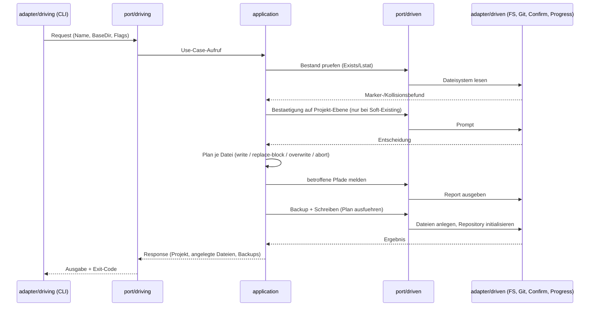
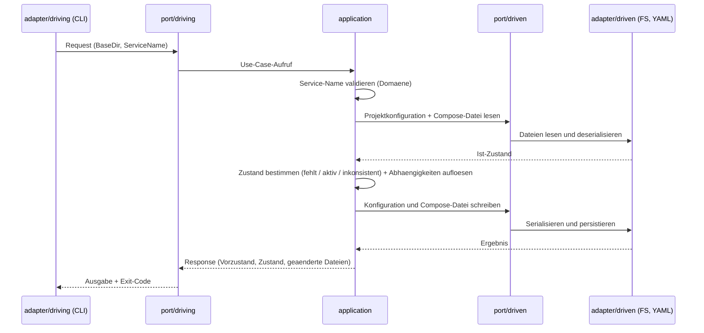
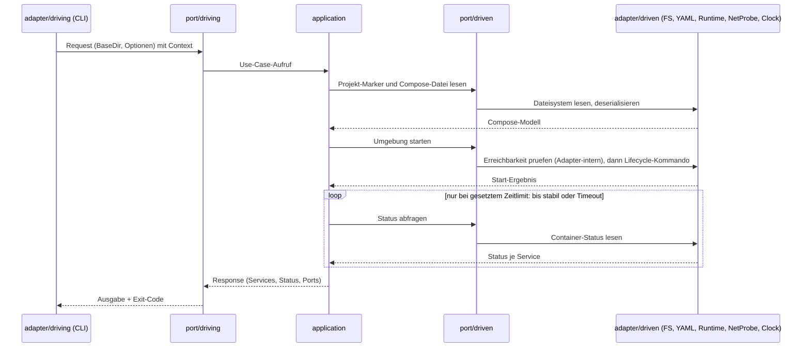

# Architektur — u-boot

**Status:** Aktiv. **Letzte Änderung:** 2026-07-25.

**Bezug:** [`LH-FA-ARCH-001`](lastenheft.md#lh-fa-arch-001--hexagonales-pattern)..[`LH-FA-ARCH-003`](lastenheft.md#lh-fa-arch-003--import-regeln-und-enforcement)

**Hard Rule:** Diese Datei enthält *keine* Wellen, Slices, Commit-Hashes,
Meilenstein-Tags oder Closure-Daten. Sie beschreibt das Zielbild, nicht den
Projektfortschritt; die zeitliche Schicht lebt in
`docs/plan/planning/in-progress/roadmap.md` und in den Closure-Notizen der
Slices.

---

## 1. Überblick

u-boot folgt dem **hexagonalen Architektur-Pattern** (auch: *Ports & Adapters*, Alistair Cockburn, 2005).

Sechs Schichten plus Wiring, klare Verantwortungen und einseitig gerichtete Abhängigkeiten:

```
            ┌──────────────────────────────────────────────────┐
            │                cmd/uboot (Wiring)                │
            │   (instanziiert Application + Adapter; main.go)  │
            └────────────────────┬─────────────────────────────┘
                                 │
        ┌────────────────────────┴─────────────────────────────┐
        ▼                                                      ▼
┌──────────────────┐                            ┌──────────────────────┐
│  adapter/driving │ → ruft AppService an  →    │  adapter/driven      │
│   (CLI-Commands) │                            │  (Docker, FS, YAML)  │
└──────────────────┘                            └──────────────────────┘
        │                                                      ▲
        │   ruft via Port-Interface                            │   wird via Port-Interface
        ▼                                                      │   aus Application gerufen
┌──────────────────┐    ┌─────────────────────────┐   ┌────────┴────────────┐
│ hexagon/         │    │ hexagon/                │   │ hexagon/            │
│   port/driving   │ →  │   application           │ → │   port/driven       │
└──────────────────┘    │   (Use-Cases)           │   └─────────────────────┘
                        └────────────┬────────────┘
                                     │
                                     ▼
                          ┌──────────────────────┐
                          │ hexagon/domain       │
                          │ (reine Datentypen)   │
                          └──────────────────────┘
```

Pfeile zeigen die **Aufruf-/Datenfluss-Richtung** zur Laufzeit. Die **Import-Richtung** ist nicht überall identisch: `application` importiert nur Ports (Interfaces) und kennt die konkreten Adapter nicht; Dependency Injection findet im Wiring (`cmd/uboot/`) statt. Die innere Welt (`hexagon/`) kennt die äußere Welt (`adapter/`) **nicht** — das wird per `depguard` durchgesetzt ([`LH-FA-ARCH-003`](lastenheft.md#lh-fa-arch-003--import-regeln-und-enforcement), siehe §5).

---

## 2. Schichten und Verzeichnisse

### 2.1 `hexagon/domain`

Reine Datentypen und invariantenhaltige Verhaltensregeln ohne I/O.

- **Inhalt:** `Project` (Aggregat mit `SchemaVersion`), `ProjectName` (Value-Object mit Regex aus [`LH-FA-INIT-006`](lastenheft.md#lh-fa-init-006--projektnamen-validierung)), `NormalizeProjectName` (deterministische Normalisierung nach [`LH-FA-INIT-002`](lastenheft.md#lh-fa-init-002--projektname)), `ErrInvalidProjectName`-Sentinel; `ServiceName` (Value-Object für Add-on-Identifier mit eigener Regex, Sentinel `ErrInvalidServiceName`) und `ServiceState`-Enum (Active/Deactivated/EnabledUnset/Unregistered/InconsistentYAML/InconsistentBlock) für die [`LH-FA-ADD-005`](lastenheft.md#lh-fa-add-005--mehrfaches-hinzufügen-verhindern)-State-Machine; `DiagnosticReport` mit `Severity`-Enum (`SeverityOK`/`SeverityWarn`/`SeverityError`) und `Diagnostic{ID, Severity, Message, Hint}` für die Doctor-Use-Cases ([`LH-FA-DIAG-003`](lastenheft.md#lh-fa-diag-003--fehlerklassifikation)).
- **Vorgesehene Erweiterungen:** `Service`, `Port`, `ImageRef`, `ComposeFile`, `EnvVar` für Add-on-Use-Cases.
- **Erlaubte Imports:** ausschließlich Go-Standard-Library.
- **Verbotene Imports:** alle anderen `internal/`-Pakete, externe Libraries mit I/O.
- **Tests:** Unit-Tests mit `*_test.go` im selben Paket; pure Validierung ohne Mocks.

### 2.2 `hexagon/application`

Anwendungslogik (Use-Cases). Orchestriert Domäne und Ports, enthält keine externe I/O.

- **Inhalt:**
  - `InitProjectService` orchestriert `FileSystem`/`YAMLCodec`/`Git`/`ProgressPort`/`Confirmer`/`Logger` zum [`LH-FA-INIT-001`](lastenheft.md#lh-fa-init-001--neues-projekt-initialisieren)..[`LH-FA-INIT-007`](lastenheft.md#lh-fa-init-007--git-repository-initialisierung)-Flow inklusive Re-Init-Pfaden nach [`LH-FA-INIT-005`](lastenheft.md#lh-fa-init-005--überschreibschutz) (`--force`/`--backup`) und [`LH-FA-INIT-004`](lastenheft.md#lh-fa-init-004--bestehendes-projekt-erkennen) Soft-Existing-Detection. Templates für die erzeugten Dateien via `embed.FS` + `text/template` (Templates leben unter `application/templates/*.tmpl`; die §611-strukturierten Configs wrappen ihren Inhalt in `BEGIN/END U-BOOT MANAGED BLOCK: init`-Marker). `ubootYAMLConfig`-Struct als Schema-Repräsentation für `u-boot.yaml` ([`LH-FA-CONF-002`](lastenheft.md#lh-fa-conf-002--inhalt-der-konfiguration)). Re-Init folgt einem strikten Plan-and-Execute-Split: `planFile` entscheidet pro Datei (`actionWrite`/`actionReplaceBlock`/`actionOverwriteFull`/Abort-Sentinel), Plan-Fehler verhindern jeden Side-Effect.
  - `DoctorService` orchestriert `FileSystem`/`Git`/`DockerProbe`/`Logger` zu den [`LH-FA-DIAG-002`](lastenheft.md#lh-fa-diag-002--lokale-voraussetzungen-prüfen)-Checks (write-permissions, git availability, docker installed/reachable, compose installed, später u-boot.yaml/compose.yaml-Validierung, Devcontainer-Konsistenz). Stdlib-Semver-Min-Check (`parseSemverMajorMinor` + `classifyVersionAtLeast`) für die Mindestversionen 24.0 (Docker) / 2.20 (Compose). Service ist severity-agnostisch — failures sind `SeverityError`-Diagnostics im Report, kein Go-error.
- **Hilfs-Pakete:** `application/managedblock/` ([`LH-SA-FILE-002`](lastenheft.md#lh-sa-file-002--markierte-verwaltete-bereiche)-Marker-Parser: `Find`/`Has`/`Replace`, drei Comment-Styles Hash/HTMLComment/DoubleSlash, Sentinel `ErrBlockNotFound`/`ErrBlockMalformed`); `application/backup.go` mit `BackupPath` (kleinster-freier-Suffix-Algorithmus für `<path>.bak[.N]`, File + rekursive Verzeichnisse, TOCTOU-sicher via `WriteFileExclusive`/`Mkdir`, Rollback bei partiellem Tree-Copy, Mode- und Symlink-Reject per Lstat, Streaming-Copy via `FileSystem.Copy`/`CopyExclusive`).
- **Vorgesehene Erweiterungen:** `AddServiceService` (LH-FA-ADD-*), `UpService`/`DownService` (LH-FA-UP-*), `GenerateService` (LH-FA-GEN-*).
- **Erlaubte Imports:** `hexagon/domain`, `hexagon/port/driving`, `hexagon/port/driven` (zum Konsumieren von Driven-Ports und Implementieren von Driving-Ports).
- **Verbotene Imports:** `adapter/*`, externe I/O-Libraries.
- **Tests:** Unit-Tests mit Test-Doubles für Driven-Ports (Fakes oder Mocks in `_test.go`); Test-Library-Imports (z. B. `yaml.v3` für Fake-YAMLCodec) sind über den `*_test.go`-Carveout in [`LH-FA-ARCH-003`](lastenheft.md#lh-fa-arch-003--import-regeln-und-enforcement) erlaubt.

### 2.3 `hexagon/port/driving`

Interfaces, über die u-boot von außen angesprochen wird.

- **Inhalt:**
  - `InitProjectUseCase` mit `InitProjectRequest` (`Name`/`BaseDir`/`SkipGit`/`Force`/`Backup`/`AssumeExisting`/`NoInteractive`) und `InitProjectResponse` (`Project`/`Created`/`Backups []BackupAction`).
  - `DoctorUseCase` mit `DoctorRequest` (`BaseDir`) und `DoctorResponse` (`Report domain.DiagnosticReport`). Per Kontrakt liefert `Check` immer einen Report; check-failures sind `SeverityError`-Diagnostics, kein Go-error. Severity-Klassifikation + Exit-Code-Mapping (`--strict`) übernimmt der CLI-Adapter.
  - `AddServiceUseCase` mit `AddServiceRequest` (`BaseDir`/`ServiceName`) und `AddServiceResponse` (`ServiceName`/`PriorState`/`State`/`Changed []string`). Idempotenz-garantiert: Zweit-Add mit gleichen Args ist no-op + nil-error (`PriorState=Active`, `Changed=nil`).
- **Sentinels** für die [`LH-FA-CLI-006`](lastenheft.md#lh-fa-cli-006--exit-codes)-Exit-Code-Klassifikation (liegen im `driving`-Paket statt im `application`-Paket, damit der CLI-Adapter via `errors.Is` auf sie verzweigt, ohne `application` zu importieren — [`LH-FA-ARCH-003`](lastenheft.md#lh-fa-arch-003--import-regeln-und-enforcement)):
  - **Code 10 (Validierung):** `ErrProjectExists` ([`LH-FA-INIT-004`](lastenheft.md#lh-fa-init-004--bestehendes-projekt-erkennen) Marker u-boot.yaml/compose.yaml/.env.example), `ErrFileExists` (Non-Marker-Kollision), `ErrBaseDirMissing` ([`LH-AK-001`](lastenheft.md#lh-ak-001--minimaler-init-flow) oder leeres `BaseDir`-Feld; geteilt zwischen `InitProjectUseCase` und `DoctorUseCase`), `ErrForceRequiresBackup` ([`LH-FA-INIT-005`](lastenheft.md#lh-fa-init-005--überschreibschutz) §619), `ErrBackupUnsupportedKind` (Symlink-Reject), `ErrProjectNotInitialized` ([`LH-FA-ADD-001`](lastenheft.md#lh-fa-add-001--add-on-befehl) — kein/unparsbares u-boot.yaml), `ErrServiceUnsupported` ([`LH-FA-ADD-002`](lastenheft.md#lh-fa-add-002--postgresql-hinzufügen) — ServiceName syntaktisch valide aber nicht im built-in catalog), `ErrServiceInconsistent` ([`LH-FA-ADD-005`](lastenheft.md#lh-fa-add-005--mehrfaches-hinzufügen-verhindern) §896 — orphan compose-block ohne YAML-Anker). Plus die `domain`-Validierungs-Sentinels `ErrInvalidProjectName` und `ErrInvalidServiceName`.
  - **Code 14 (Technischer FS-Fehler):** `ErrBackupSourceMissing` (Race zwischen Caller-Check und Backup), `ErrBackupSuffixExhausted` (.bak[.0..999] alle belegt).
- **Vorgesehene Erweiterungen:** `RemoveServiceUseCase`, `LifecycleUseCase` (Up/Down), `GenerateUseCase`, `ConfigUseCase`.
- **Implementiert von:** Strukturen in `hexagon/application`.
- **Verwendet von:** `adapter/driving/*` (z. B. `cli/`).

### 2.4 `hexagon/port/driven`

Interfaces, über die `hexagon/application` externe Systeme nutzt.

- **Inhalt:**
  - `FileSystem` (`Exists`/`ReadFile`/`WriteFile`/`WriteFileExclusive`/`Mkdir`/`MkdirAll`/`Rename`/`ReadDir`/`Lstat`/`RemoveAll`/`Copy`/`CopyExclusive`). Folgt `os.*`-Konventionen: `Lstat` (no-follow für Symlink-Detection und Mode-Preservation), `WriteFileExclusive` (O_CREATE|O_EXCL für TOCTOU-sichere Backup-Slot-Reservierung), `Mkdir` (analog für Dir-Slots), `RemoveAll` (Rollback bei partiellem Tree-Copy), `Copy`/`CopyExclusive` (Streaming-Backup via `io.Copy` ohne RAM-Cap).
  - `YAMLCodec` (`Marshal`/`Unmarshal`).
  - `Git` (`IsRepository`/`Init`/`Version`) — alle mit `context.Context` als erstem Parameter (Adapter shellt zum `git`-Binary, das blockieren kann). `Version` liefert die bare semver (Adapter strippt das `git version `-Prefix).
  - `Clock` (`Now`) — ohne Context (Implementierung non-blocking).
  - **Context-Konvention:** nur Ports, deren Adapter blockieren können (Git, Docker via `os/exec`), nehmen Context; FS/YAML/Clock bleiben Context-frei (im Paket-Doc begründet).
  - `ProgressPort` (`AffectedFiles(baseDir, rows)`) zum strukturierten Reporting der [`LH-FA-INIT-005`](lastenheft.md#lh-fa-init-005--überschreibschutz) §609 / [`LH-FA-CLI-005A`](lastenheft.md#lh-fa-cli-005a--interaktivität-und-automatisierung) §262 betroffenen Pfade vor jedem Re-Init-Write. `AffectedFile` trägt `Path`/`Action AffectedAction`/`Backup bool`; `AffectedAction` enumeriert `AffectedReplaceBlock`/`AffectedOverwriteFull`. Presentation lebt im Adapter.
  - `Confirmer` (`ConfirmTreatAsExisting(ctx, baseDir, indicators)`) für die [`LH-FA-INIT-004`](lastenheft.md#lh-fa-init-004--bestehendes-projekt-erkennen) Soft-Existing-Detection-Prompts. Narrowly scoped per Confirm-Kontext.
  - `Logger` (`Debug`/`Info`/`Warn`/`Error`, slog-konforme `...any`-Variadic) als [`LH-QA-004`](lastenheft.md#lh-qa-004--linting-solid-nahes-lint-profil)-Logging-Port.
  - `DockerProbe` (`Version`/`Info`/`ComposeVersion`) für die read-only [`LH-FA-DIAG-002`](lastenheft.md#lh-fa-diag-002--lokale-voraussetzungen-prüfen)-Probes (`docker version --format`, `docker compose version --short`). Bewusst getrennt vom state-mutierenden `DockerEngine` (siehe Erweiterungen). Backend-Annahme: ein Docker-API-kompatibles Engine-Binary auf `$PATH`. Heute Docker; Podman ≥ 4.0 funktioniert als Drop-in (`docker → podman`-Symlink + `DOCKER_HOST` auf `podman.socket`) — die Version-Klassifikation pinnt die Docker-Mindestwerte (24.0 / 2.20), Podman-Versionen werden vorerst als `Severity: warn` ("unrecognized version") emittiert, kein Exit-Code-Eskalation. Ein dedizierter Podman-Probe-Pfad ist ein eigener Slice (Trigger: erster konkreter Bedarf).
  - `RuntimeEnvironment` (`InContainer() bool`) für die best-effort Container-Self-Detection via `/.dockerenv` (Docker) / `/run/.containerenv` (Podman/CRI-O/buildah). Treibt das `doctor`-Skip-Verhalten für die vier Host-Prerequisite-Checks im distroless-Container-Run, ohne dass die Adapter im Container fehlschlagen müssten.
- **Vorgesehene Erweiterungen:** `DockerEngine` (`Up`/`Down`/`Ps`/`Logs`/`Exec`) für die Compose-Lifecycle-Operationen — explizit getrennt von `DockerProbe`, weil state-mutierend.
- **Implementiert von:** Strukturen in `adapter/driven/*`.
- **Verwendet von:** `hexagon/application`.

### 2.5 `adapter/driving`

Konkrete Driver — Einstiegspunkte aus der Außenwelt.

- **Inhalt:** `cli/` mit Cobra. Pro Subkommando ein eigenes Cobra-Command in einer eigenen Datei.
  - Lokale Flags pro Subkommando (z. B. `init`: `--no-git`/`--force`/`--backup`/`--assume-existing`).
  - **Persistente Flags (Root):** `--yes`, `--no-interactive` ([`LH-FA-CLI-005A`](lastenheft.md#lh-fa-cli-005a--interaktivität-und-automatisierung) — gelten für alle bestätigungs-relevanten Subbefehle). Konflikt-Check `--yes` + `--no-interactive` → `ErrConflictingModeFlags` (CLI-internes Sentinel) → Exit-Code 2.
  - `ExitCode(err)` bündelt die [`LH-FA-CLI-006`](lastenheft.md#lh-fa-cli-006--exit-codes)-Klassifikation (0 / 2 / 10 / 11 / 12 / 14 / 1); Prädikat-Helper mappen die in §2.3 gelisteten Driving-Sentinels. Vollständige Klassifikations-Reihenfolge und die zwei tragenden Regeln: §7.
  - `cli.App` mit Functional-Options-Pattern (`WithGetwd` als Test-Seam); persistente Flag-Werte werden beim Re-Build der Root-Cobra pro `Execute` zurückgesetzt — kein Flag-Leak zwischen Aufrufen.
- **Vorgesehene Erweiterungen:** weitere Subkommandos (`add`, `remove`, `up`, `down`, `doctor`, `logs`, `generate`, `config`, `template`). Ein HTTP-/Daemon-Adapter ist nicht vorgesehen; u-boot bleibt CLI-only (siehe §10).
- **Erlaubte Imports:** `hexagon/domain`, `hexagon/port/driving`, externe Libraries (z. B. Cobra).
- **Verbotene Imports:** `hexagon/application` und `adapter/driven`. Die Instanziierung von Application-Services und Driven-Adaptern erfolgt ausschließlich im Wiring (`cmd/uboot/`), das beide Welten zusammenfügt; der Driving-Adapter erhält fertig konstruierte Driving-Port-Implementierungen per Konstruktor.
- **Permanenter Carveout:** `contextcheck`-Ausnahme in `.golangci.yml`, weil Cobras `RunE`-Signatur (`func(cmd, args) error`) keinen Context-Parameter kennt — die Closure muss `cmd.Context()` extrahieren und an `runInit` durchreichen. Strikte Propagation passiert eine Ebene tiefer.

### 2.6 `adapter/driven`

Konkrete externe Adapter — Implementierungen der Driven-Ports.

- **Inhalt:**
  - `fs/` — `FileSystem`-Adapter via stdlib `os.*` (`os.ReadFile`/`WriteFile`/`MkdirAll`/`Rename`/`ReadDir`/`Lstat`/`RemoveAll`; `WriteFileExclusive` mit `O_CREATE|O_EXCL|O_WRONLY`; Streaming `Copy`/`CopyExclusive` über `os.Open` + `io.Copy`).
  - `yaml/` — `YAMLCodec`-Adapter via `gopkg.in/yaml.v3`.
  - `git/` — `Git`-Adapter via `os/exec git` mit `WithBinary`-Test-Override und Exit-Code-128-Klassifikation als „not a repo".
  - `clock/` — `Clock`-Adapter via `time.Now()` in UTC.
  - `progress/` — `ProgressPort`-Adapter (TextWriter rendert Events auf einen `io.Writer`).
  - `confirm/` — `Confirmer`-Adapter (`bufio.Scanner` über stdin, Prompt auf stderr, Default `[y/N]`).
  - `logger/` — `Logger`-Adapter via `log/slog` (Text + JSON-Format konfigurierbar).
  - `docker/` — `DockerProbe`-Adapter via `os/exec docker` (read-only diagnostics für [LH-FA-DIAG-002](lastenheft.md#lh-fa-diag-002--lokale-voraussetzungen-prüfen)).
  - Jeder Adapter pinnt sein Port-Interface per `var _ driven.X = (*Adapter)(nil)` im Production-Code; Drift bricht den Package-Build.
- **Vorgesehene Erweiterungen:** `docker/`-Erweiterung um den `DockerEngine`-Adapter (`Up`/`Down`/`Ps`/`Logs`/`Exec` via `docker compose`); `progress/json` für [`LH-NFA-USE-004`](lastenheft.md#lh-nfa-use-004--maschinenlesbare-ausgabe) `--json`.
- **Erlaubte Imports:** `hexagon/domain`, `hexagon/port/driven`, externe Libraries.
- **Verbotene Imports:** `hexagon/application`, `adapter/driving`.
- **Test-Pfad:** `t.TempDir()` für FS, echte `git`-Binary via `os/exec.LookPath`-Skip (CI-Runner ohne git skippen sauber).

### 2.7 `cmd/uboot` — Wiring-Schicht

Einziger Ort, an dem `application` und `adapter` zusammen importiert werden.

- **Inhalt:** `main.go` instantiiert die Driven-Adapter (`fs.New()`, `yaml.New()`, `git.New()`, `progress.NewText(stdout)`, `confirm.New(os.Stdin, stderr)`, `logger.New(stderr, ...)`, `docker.New()`), konstruiert die Application-Services (`InitProjectService`, `DoctorService`) mit den nötigen Ports und übergibt sie dem `cli.New(version, ...)`-Konstruktor. Plus signal-aware Context via `signal.NotifyContext(ctx, os.Interrupt, syscall.SIGTERM)` und Error→Exit-Code-Mapping über `cli.ExitCode(err)`.
- Hält keine Geschäftslogik. So klein wie sinnvoll möglich (Größenordnung 150–300 Zeilen `main.go` plus ein paar kleine Wiring-Helper); ab dieser Marke ist eine Aufteilung in mehrere Wiring-Pakete (`internal/wire/<feature>/`) zu erwägen.

---

## 3. Externe Abhängigkeiten

Welche externen Systeme und Bibliotheken Teil der Architektur sind, in welcher
Schicht sie auftauchen dürfen und wie austauschbar sie sind. Die
*Wahl-Begründung* je Abhängigkeit gehört nicht hierher — sie steht in der
jeweiligen Architekturentscheidung, die ihre Kopplung an diese Sicht aufwärts
deklariert.

| System | Rolle | Sichtbar in Schicht | Substituierbarkeit |
| --- | --- | --- | --- |
| Container-Runtime mit Compose-Schnittstelle (Docker-API-kompatibles Binary auf `$PATH`) | Diagnose (read-only Probes) und Lifecycle-Operationen der erzeugten Umgebung | `adapter/driven` (hinter `DockerProbe`/`DockerEngine`) | hoch — die Application kennt nur die Ports; ein Podman-Setup funktioniert als Drop-in, ein SDK-basierter Adapter wäre ein Paket-Austausch ohne Änderung an `application` |
| CLI-Framework (Kommando-/Flag-Parsing) | Aufbau des Kommando-Baums, Flag-Bindung, Hilfe-Ausgabe | ausschließlich `adapter/driving/cli` | hoch — kein Port, kein Use-Case und kein Domänentyp kennt das Framework; der Austausch bleibt im Driving-Adapter |
| YAML-Serialisierung | Lesen/Schreiben der Projektkonfiguration und der Compose-Datei | `adapter/driven` (hinter `YAMLCodec`) | hoch — ein Adapter-Paket |
| `git`-Binary | optionale Repository-Initialisierung beim Anlegen eines Projekts | `adapter/driven` (hinter `Git`) | hoch — fehlt es, degradiert der Pfad kontrolliert; die Application sieht nur den Port |
| Go-Standardbibliothek (Dateisystem, Prozess-Start, strukturiertes Logging, eingebettete Templates) | Ausführungsunterbau der Adapter sowie Template-Rendering in der Application | `adapter/*`, `hexagon/application` (nur Template-Rendering) | niedrig (Sprachumfeld) — die Domäne bleibt davon frei |

Zwei Regeln halten die Liste kurz: Externe Abhängigkeiten erscheinen **nur** in
Adaptern (Ausnahme: das I/O-freie Template-Rendering in der Application), und
jede von ihnen steht hinter einem Port. `hexagon/domain` importiert keine
externe Bibliothek — das ist die schärfste der Import-Regeln und per `depguard`
durchgesetzt.

---

## 4. Import-Regeln

| Schicht                | darf importieren                                                              | darf nicht importieren                                     |
| ---------------------- | ----------------------------------------------------------------------------- | ---------------------------------------------------------- |
| `hexagon/domain`       | Go-Standard-Library                                                           | alle anderen `internal/`-Pakete, I/O-Libraries             |
| `hexagon/application`  | `hexagon/domain`, `hexagon/port/driving`, `hexagon/port/driven`               | `adapter/*`, externe I/O-Libraries                         |
| `hexagon/port/driving` | `hexagon/domain`                                                              | `hexagon/application`, `hexagon/port/driven`, `adapter/*`  |
| `hexagon/port/driven`  | `hexagon/domain`                                                              | `hexagon/application`, `hexagon/port/driving`, `adapter/*` |
| `adapter/driving`      | `hexagon/domain`, `hexagon/port/driving`, externe Libraries (z. B. Cobra)     | `hexagon/application`, `adapter/driven`                    |
| `adapter/driven`       | `hexagon/domain`, `hexagon/port/driven`, externe Libraries (z. B. Docker-SDK) | `hexagon/application`, `adapter/driving`                   |
| `cmd/uboot`            | `internal/...`, Standardbibliothek, externe Libraries                         | (frei — Wiring-Schicht)                                    |

Begründung der Regeln:

- **Domain isoliert** halten ⇒ Domänenobjekte sind portabel, testbar, frei von Framework-Annahmen.
- **Application kennt nur Ports** ⇒ Use-Cases sind ohne reale Docker-Engine testbar (Fake-`DockerEngine`).
- **Ports sind kreuz-blind** (`driving` ↔ `driven`) ⇒ vermeidet versteckte Kopplungen über das Application.
- **Wiring in cmd/** ⇒ Austausch eines Adapters (z. B. von `os/exec` Docker auf das Docker-SDK) erfordert keine Änderung in `application` oder `hexagon/port`.

---

## 5. Enforcement via `golangci-lint depguard`

Die Regeln aus Abschnitt 4 werden im `lint`-Stage ([`LH-FA-BUILD-001`](lastenheft.md#lh-fa-build-001--multi-stage-dockerfile-u-boot-repo)) per `golangci-lint` mit dem `depguard`-Linter durchgesetzt. Konfiguration aktiv in [`.golangci.yml`](../.golangci.yml); das untenstehende Schema ist deckungsgleich mit der dortigen Konfiguration. Bei Änderungen müssen beide Quellen synchron gehalten werden.

Konventionen für jeden Regelblock:

- `list-mode: lax` — `deny`-only-Auswertung (Imports ohne `deny`-Treffer sind erlaubt, kein impliziter `allow`-Filter).
- `files` enthält als erste Pattern `!**/*_test.go`, um Tests vom Enforcement auszunehmen (Tests dürfen Fakes und Test-Libraries frei importieren; [`LH-FA-ARCH-003`](lastenheft.md#lh-fa-arch-003--import-regeln-und-enforcement)).
- `deny`-Einträge nennen den blockierten Modul-Pfad und in `desc` die LH-Kennung als Begründung.

```yaml
linters:
  enable:
    - depguard

  settings:
    depguard:
      rules:
        domain-isoliert:
          list-mode: lax
          files:
            - '!**/*_test.go'
            - '**/internal/hexagon/domain/**'
          deny:
            - pkg: github.com/pt9912/u-boot/internal/hexagon/application
              desc: domain must not depend on application (LH-FA-ARCH-003)
            - pkg: github.com/pt9912/u-boot/internal/hexagon/port
              desc: domain must not depend on port (LH-FA-ARCH-003)
            - pkg: github.com/pt9912/u-boot/internal/adapter
              desc: domain must not depend on adapter (LH-FA-ARCH-003)

        application-no-adapter:
          list-mode: lax
          files:
            - '!**/*_test.go'
            - '**/internal/hexagon/application/**'
          deny:
            - pkg: github.com/pt9912/u-boot/internal/adapter
              desc: application must depend on ports, not on adapter implementations (LH-FA-ARCH-003)

        port-no-application:
          list-mode: lax
          files:
            - '!**/*_test.go'
            - '**/internal/hexagon/port/**'
          deny:
            - pkg: github.com/pt9912/u-boot/internal/hexagon/application
              desc: port must not depend on application (LH-FA-ARCH-003)
            - pkg: github.com/pt9912/u-boot/internal/adapter
              desc: port must not depend on adapter (LH-FA-ARCH-003)

        port-driving-no-driven:
          list-mode: lax
          files:
            - '!**/*_test.go'
            - '**/internal/hexagon/port/driving/**'
          deny:
            - pkg: github.com/pt9912/u-boot/internal/hexagon/port/driven
              desc: driving port must not depend on driven port (LH-FA-ARCH-003)

        port-driven-no-driving:
          list-mode: lax
          files:
            - '!**/*_test.go'
            - '**/internal/hexagon/port/driven/**'
          deny:
            - pkg: github.com/pt9912/u-boot/internal/hexagon/port/driving
              desc: driven port must not depend on driving port (LH-FA-ARCH-003)

        adapter-no-application:
          list-mode: lax
          files:
            - '!**/*_test.go'
            - '**/internal/adapter/**'
          deny:
            - pkg: github.com/pt9912/u-boot/internal/hexagon/application
              desc: adapter must implement ports, not consume application (LH-FA-ARCH-003)

        adapter-driving-no-driven:
          list-mode: lax
          files:
            - '!**/*_test.go'
            - '**/internal/adapter/driving/**'
          deny:
            - pkg: github.com/pt9912/u-boot/internal/adapter/driven
              desc: driving adapter must not depend on driven adapter — wire via cmd/uboot (LH-FA-ARCH-003)

        adapter-driven-no-driving:
          list-mode: lax
          files:
            - '!**/*_test.go'
            - '**/internal/adapter/driven/**'
          deny:
            - pkg: github.com/pt9912/u-boot/internal/adapter/driving
              desc: driven adapter must not depend on driving adapter (LH-FA-ARCH-003)
```

Jede `depguard`-Regel matcht mindestens ein Paket im Produktiv-Code; die Pro-Schicht-Verifikation läuft per `scripts/verify-depguard.sh` (Target `make verify-depguard`), das pro Regel einen deklariert verbotenen Import injiziert, `make lint` auf das erwartete `desc:` prüft und die Stub-Datei revertiert.

`//nolint:depguard`-Pragmas sind verboten. Carveouts werden zentral in `.golangci.yml` mit `desc` dokumentiert ([`LH-FA-ARCH-003`](lastenheft.md#lh-fa-arch-003--import-regeln-und-enforcement)).

---

## 6. Sequenz-Diagramme

Die kritischen Use-Cases als Fluss durch die Schichten. Lanes sind
Architektur-Schichten, nicht Funktionen. Was maschinell abgesichert ist, sind
die **Schicht-Grenzen** selbst (`depguard` prüft Import-Richtungen); die
**Schritt-Reihenfolge** in den Diagrammen ist es *nicht* — sie altert mit dem
Code und muss beim Ändern eines Use-Case von Hand mitgezogen werden. Die
Fehlerpfade sind bewusst ausgespart; sie stehen in §7.

### Use-Case: Projekt initialisieren ([`LH-FA-INIT-001`](lastenheft.md#lh-fa-init-001--neues-projekt-initialisieren), [`LH-FA-INIT-004`](lastenheft.md#lh-fa-init-004--bestehendes-projekt-erkennen), [`LH-FA-INIT-005`](lastenheft.md#lh-fa-init-005--überschreibschutz))

Der Re-Init-Pfad ist der eigentliche Lehrfall: **Plan vor Execute**. Der
Use-Case entscheidet pro Datei vollständig, was passieren würde, meldet die
betroffenen Pfade und schreibt erst danach. Ein Fehler in der Planungsphase
erzeugt keinen einzigen Seiteneffekt.

Die Bestätigung der Soft-Existing-Erkennung läuft bewusst **vor** dem
Datei-Plan: Sie ist eine Frage auf Projekt-Ebene („behandle ich das hier als
bestehendes Projekt?") und wird einmal gestellt, statt als Kaskade von
Kollisions-Rückfragen pro Datei aufzutreten.



### Use-Case: Add-on hinzufügen ([`LH-FA-ADD-001`](lastenheft.md#lh-fa-add-001--add-on-befehl), [`LH-FA-ADD-005`](lastenheft.md#lh-fa-add-005--mehrfaches-hinzufügen-verhindern), [`LH-FA-ADD-006`](lastenheft.md#lh-fa-add-006--add-on-abhängigkeiten))

Kennzeichen dieses Flusses ist die **Idempotenz-Entscheidung vor jeder
Mutation**: Der Use-Case liest den Ist-Zustand aus Konfiguration *und*
Compose-Datei, bevor er etwas ändert; ein Zweit-Add mit gleichen Argumenten ist
ein no-op ohne Fehler.



### Use-Case: Umgebung starten ([`LH-FA-UP-001`](lastenheft.md#lh-fa-up-001--umgebung-starten), [`LH-FA-UP-003`](lastenheft.md#lh-fa-up-003--startstatus-anzeigen))

Hier verlässt der Fluss den Prozess: Die Container-Runtime ist ein externes,
langsames und fehleranfälliges System. Deshalb trägt dieser Port einen Context,
und deshalb hat er eigene Fehlerklassen (§7).

Zwei Eigenheiten dieses Flusses: Der Use-Case prüft die Voraussetzungen über
**Datei-Ports** (Projekt initialisiert, Compose-Datei lesbar), nicht über die
Runtime — die read-only Erreichbarkeitsprüfung der Runtime liegt eine Ebene
tiefer *im Driven-Adapter* und läuft dort vor jedem Lifecycle-Kommando. Und die
Stabilisierungs-Schleife ist optional: Ohne gesetztes Zeitlimit endet der
Use-Case unmittelbar nach dem Start, mit einem Hinweis-Diagnostic statt einem
Status.



---

## 7. Fehlermodelle und Resilienz

### 7.1 Wo Fehler entstehen und wer sie behandelt

Grundsatz: Die inneren Schichten **klassifizieren** Fehler fachlich (als
Sentinel-Werte), der Driving-Adapter **übersetzt** sie in den
Exit-Code-Vertrag und in die maschinenlesbare Ausgabe. Die Application kennt
keine Exit-Codes; der Adapter kennt keine Use-Case-Interna.

| Fehlerquelle | Klassifiziert in | Behandelt in | Exit-Klasse | Sichtbarkeit |
| --- | --- | --- | --- | --- |
| Falsche Kommandozeilen-Nutzung (unbekanntes Flag, widersprüchliche Modus-Flags, falsche Argumentzahl) | `adapter/driving` | `adapter/driving` | 2 | Fehlertext auf stderr, Hilfe-Hinweis |
| Fachliche Validierung (Namen, Projekt-Zustand, Konfigurations-Inhalt) | `hexagon/domain` bzw. `hexagon/application` als `port/driving`-Sentinel | `adapter/driving` | 10 | Fehlertext bzw. Diagnostic im Envelope |
| Bestätigungs-Gate: Freigabe verweigert oder Bestätigung nicht einholbar (destruktiver Pfad, implizite Bestandserkennung) | `hexagon/application` | `adapter/driving` | 10 | wie oben; Refusal und Confirmer-I/O-Fehler sind unterschiedliche Sentinels |
| Nicht-interaktiver Lauf trifft auf eine offene Bestätigungsfrage; ebenso sich ausschließende Modus-Flags | `adapter/driving` | `adapter/driving` | 2 | Fehlertext; der Vertrag verzweigt hier bewusst gegen die Zeile darüber |
| Diagnose-Befund im strikten Modus | `hexagon/application` (Report), Schwelle im Adapter | `adapter/driving` | 11 | Report-Ausgabe, Severity je Befund |
| Container-Runtime nicht erreichbar | `port/driven`-Sentinel aus dem Adapter | `adapter/driving` | 11 | Fehlertext mit Reparaturhinweis |
| Laufzeitfehler der Runtime (Compose-Start, Stabilisierungs-Timeout) | `port/driven`- bzw. `port/driving`-Sentinel | `adapter/driving` | 12 | Fehlertext, ggf. Teil-Status |
| Technischer Dateisystem-/Persistenzfehler (unerwartete IO-, Permission-, Backup-Slot-Fehler) | `hexagon/application` als `port/driving`-Sentinel | `adapter/driving` | 14 | Fehlertext; Plan-Phase verhindert Teil-Schreibzustände |
| Alles übrige | — | `adapter/driving` | 1 | generischer Fehlertext |

Die technischen Klassen `13` und `15` sind vertraglich **erlaubt**, sobald ihre
Bedeutung für den aufrufenden Kontext dokumentiert ist; u-boot belegt sie heute
nicht. **Reserviert** — also nicht zu verwenden — sind allein `3`–`9` und
`16`–`19`.

### 7.2 Zwei Regeln, die die Klassifikation zusammenhalten

**Sentinel-Schichtung.** Die Klassifikation prüft **Driven-Sentinels zuerst**,
danach Driving-/Application-Sentinels. Grund: Ein Fehler der äußeren Welt kann
auf dem Weg nach oben von einer fachlichen Hülle umschlossen werden; würde die
fachliche Hülle zuerst greifen, verlöre die Ausgabe die genauere Ursache. Die
Prüf-Reihenfolge folgt damit der Schicht-Hierarchie, nicht der Lesereihenfolge
im Code. Sentinels überschneiden sich nicht.

**Dual-Classifier-Regel.** Ein Driving-Sentinel wird im Driving-Adapter über
**zwei voneinander unabhängige Klassifikatoren** geführt:

1. die **eine, zentrale** Exit-Code-Klassifikation des Adapters, und
2. die **Diagnostic-Abbildung des Subkommandos**, über dessen Pfad der Sentinel
   auftreten kann — davon gibt es **eine pro Subkommando**, nicht eine
   gemeinsame.

Daraus folgt die eigentliche Falle: Ein *querliegender* Sentinel (etwa „Projekt
nicht initialisiert", der an fast jedem Subkommando auftreten kann) steht in der
zentralen Klassifikation **plus in jeder** betroffenen Kommando-Abbildung. Wer
nur die zentrale Stelle und *ein* Kommando pflegt, erzeugt einen Prozess, dessen
Exit-Code und dessen JSON-Ausgabe je nach Subkommando verschiedene Dinge
behaupten — ein Vertragsbruch gegenüber
[`LH-FA-CLI-006`](lastenheft.md#lh-fa-cli-006--exit-codes) und
[`LH-NFA-USE-004`](lastenheft.md#lh-nfa-use-004--maschinenlesbare-ausgabe)
zugleich. Der Fehlerfall tritt typisch beim **Aufteilen** eines bestehenden
Sentinels auf, und er trifft zuerst die Sentinels mit der größten Reichweite.
Deshalb gilt: Jeder neue oder aufgeteilte Driving-Sentinel braucht den Eintrag
in der zentralen Klassifikation, den Eintrag in *jeder* betroffenen
Kommando-Abbildung und einen Test, der seine Exit-Klasse pinnt. Ein Sensor, der
die Abdeckung über alle Kommandos hinweg vergleicht, existiert heute nicht.

### 7.3 Resilienz-Muster

- **Plan vor Execute.** Zustandsverändernde Use-Cases entscheiden vollständig,
  bevor sie schreiben. Ein Fehler in der Planungsphase hinterlässt keinen
  Seiteneffekt. Grenze des Musters: Innerhalb der Ausführungsphase gibt es
  keinen generellen Rollback über mehrere Dateien — wo das relevant ist, wird es
  als bewusste Ausnahme geführt.
- **Kein stilles Überschreiben.** Bestehende Nutzerdateien werden entweder in
  ihrem markierten verwalteten Bereich ersetzt oder nur nach Bestätigung und mit
  Backup vollständig überschrieben
  ([`LH-NFA-REL-001`](lastenheft.md#lh-nfa-rel-001--kein-stilles-überschreiben),
  [`LH-SA-FILE-002`](lastenheft.md#lh-sa-file-002--markierte-verwaltete-bereiche)).
  Backup-Slots werden kollisionssicher reserviert, nicht optimistisch benannt.
- **Nil-tolerante Ports.** Use-Cases akzeptieren fehlende optionale Ports und
  fallen auf wirkungslose Standard-Implementierungen zurück, statt zu
  dereferenzieren. Ein unvollständiges Wiring degradiert damit die Ausgabe,
  statt den Prozess abstürzen zu lassen.
- **Context an den blockierenden Rändern.** Ports, deren Adapter externe
  Prozesse starten, führen einen Context; nicht-blockierende Ports bleiben
  context-frei. Das Wiring verbindet den Context mit den Abbruch-Signalen des
  Betriebssystems, sodass ein Abbruch bis in den Runtime-Aufruf durchschlägt.
- **Idempotenz als Vertrag, nicht als Zufall.** Wiederholte Aufrufe mit
  gleichen Argumenten sind no-ops mit Erfolgs-Ergebnis
  ([`LH-AK-006`](lastenheft.md#lh-ak-006--idempotenz)); der Ist-Zustand wird vor
  jeder Mutation gelesen, nicht angenommen.

---

## 8. Tests

- Unit-Tests stehen als `*_test.go` neben dem produktiven Code im selben Paket.
- **Domäne:** klassische Property/Value-Tests; keine Mocks nötig.
- **Application:** Fake-Implementierungen der Driven-Ports im `_test.go`-Paket; keine echte Docker-Engine.
- **Adapter (driven):** Integrationstests gegen echte Systeme, soweit lokal verfügbar (z. B. Docker-Engine für `adapter/driven/docker`). Ohne Docker-Engine werden diese Tests via Build-Tag (`//go:build docker`) ausgeschlossen. Build-Tag-Konvention:
  - Default ist *aus*: `make test` (Stage `test` im Dockerfile, [`LH-FA-BUILD-001`](lastenheft.md#lh-fa-build-001--multi-stage-dockerfile-u-boot-repo)) führt Tag-getaggte Tests nicht aus und bleibt damit auch ohne Docker-Socket grün.
  - Lokal mit verfügbarer Docker-Engine: `go test -tags docker ./...`.
  - In CI: ein separater Stage / ein separates Make-Target (Folge-Slice) aktiviert das Tag und mountet das Docker-Socket; dieser Pfad ist nicht Bestandteil von `make gates`, sondern ergänzt `make ci` als optionales Integrations-Smoketest-Ziel.
  - Pro Test-Datei mit dem entsprechenden Tag: erste Zeile `//go:build docker`, leere Zeile, dann `package …`.
- **Adapter (driving):** Tabellengetriebene Tests gegen den Driving-Port mit Fake-Application.
- Coverage-Messung ([`LH-FA-BUILD-008`](lastenheft.md#lh-fa-build-008--coverage-bootstrap)) bezieht sich auf `./internal/...`; `./cmd/...` ist ausgeschlossen.

---

## 9. Anti-Patterns

Die folgenden Muster sind verboten und werden im Review abgelehnt:

- **God-Service:** ein `application`-Service, der alle Use-Cases bündelt. Stattdessen ein Service pro Use-Case-Familie.
- **Anämische Domäne:** Domänentypen ohne Verhalten, die nur Daten halten. Domänen-Invarianten gehören in die Domäne.
- **Adapter ruft Adapter:** `adapter/driving` importiert `adapter/driven` direkt. Wiring gehört in `cmd/uboot`.
- **Port importiert Application:** zyklische Abhängigkeit, verbietet sich aus Architektur und ist `depguard`-blockiert.
- **`//nolint:depguard`** zur Umgehung einer Schicht-Regel. Es gibt keinen legitimen Carveout im Fachcode; wenn eine Regel im Weg steht, gehört die Schicht-Definition korrigiert.
- **Externe Library im `domain`-Paket** (`yaml.v3`, Docker-SDK, Cobra, …). Domäne bleibt I/O-frei.

---

## 10. Evolution

Änderungen an dieser Architektur erfolgen über
neue Architekturentscheidungen und anschließende Spec-Nachführung
([`LH-FA-PROJDOCS-002`](lastenheft.md#lh-fa-projdocs-002--adr-format)).

Geplante Erweiterungen, die im aktuellen Dokument noch nicht abgebildet sind: keine.

**Nicht** geplant:

- HTTP-Driving-Adapter (Daemon-Variante): u-boot bleibt CLI-only;
  Maschinen-Schnittstellen laufen über `--json`/`--dry-run`-Flags
  ([`LH-NFA-USE-004`](lastenheft.md#lh-nfa-use-004--maschinenlesbare-ausgabe)).
- Plugin-System ([`LH-OPEN-003`](lastenheft.md#lh-open-003--plugin-system-entschieden)):
  das Add-on-System bleibt statisch; kein `PluginRegistry`-Driven-Port.
